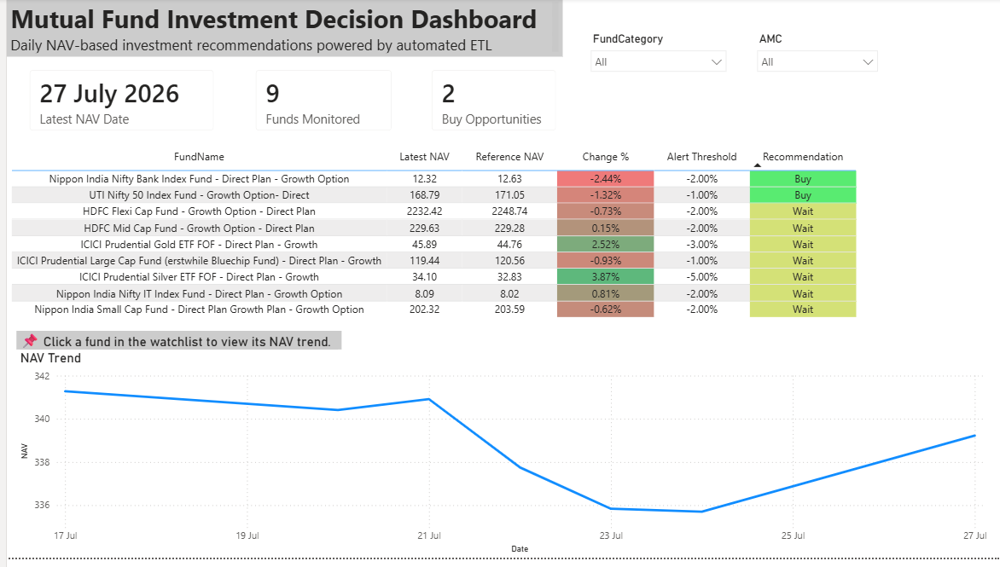
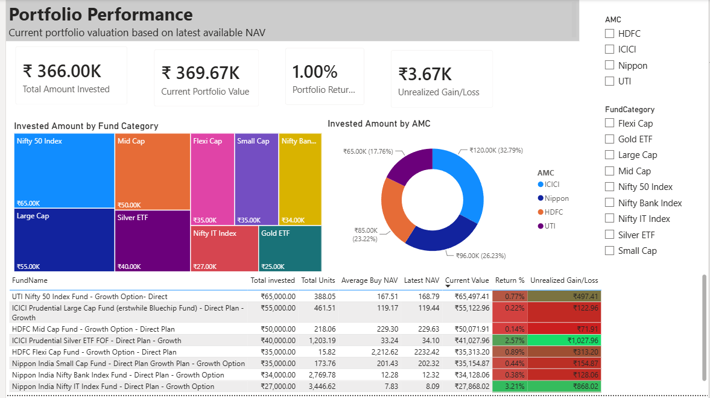

# 📈 Mutual Fund Investment Analytics


An end-to-end Business Intelligence project that automates **Mutual Fund NAV collection, investment tracking, portfolio analytics, and investment recommendations** using **Python, SQL Server, and Power BI**.

---

# 📌 Project Overview

This project eliminates manual tracking of mutual fund investments by automating the complete workflow:

- Download daily NAV data from AMFI
- Store historical NAV data in SQL Server
- Register investment transactions
- Calculate units automatically
- Generate Buy/Wait recommendations
- Monitor portfolio performance using Power BI

---

# 🎯 Business Problem

Retail investors often struggle to:

- Track daily NAV movements
- Identify good buying opportunities
- Monitor portfolio performance
- Calculate current portfolio value
- Analyze investment allocation

This project provides a single dashboard to solve these problems through automation and analytics.

---

# 🏗 Solution Architecture

```text
AMFI NAV Data
      │
      ▼
Python ETL
(download_nav.py & daily_etl.py)
      │
      ▼
SQL Server
(FundMaster, NAVHistory, Transactions)
      │
      ▼
Power BI Dashboard
      │
      ├── Page 1 : Buy Opportunity Dashboard
      └── Page 2 : Portfolio Performance Dashboard
```

---

# 🛠 Technology Stack

| Technology | Purpose |
|------------|---------|
| Python | ETL & Automation |
| SQL Server | Database |
| Power BI | Dashboard & Reporting |
| Pandas | Data Processing |
| PyODBC | SQL Connectivity |
| DAX | Business Calculations |
| AMFI NAV Data | Data Source |

---

# ⭐ Key Features

- Automated NAV data collection
- Historical NAV tracking
- SQL Server relational database
- Duplicate NAV prevention
- Mutual fund registration utility
- Transaction registration utility
- Automatic unit calculation
- Buy/Wait recommendation engine
- Portfolio performance analytics
- Interactive Power BI dashboards

---

# 📊 Dashboard

## Page 1 – Buy Opportunity Dashboard

**Purpose**

Helps investors identify buying opportunities by comparing the latest NAV with the first available NAV of the current month.

### Includes

- Latest NAV
- Month Start NAV
- NAV Change %
- Buy/Wait Recommendation
- Buy Opportunities KPI
- NAV Trend
- Fund & AMC slicers

---

## Page 2 – Portfolio Performance Dashboard

**Purpose**

Tracks the overall portfolio performance using investment transactions.

### Includes

- Total Invested
- Total Units Held
- Current Portfolio Value
- Unrealized Gain/Loss
- Portfolio Return %
- Investment by AMC
- Investment by Category
- Portfolio Holdings Table

---

# 💡 Investment Recommendation Logic

The recommendation engine compares:

```text
Latest NAV
        ↓
Month Start NAV
        ↓
NAV Change %
        ↓
Configured Alert Threshold
        ↓
BUY / WAIT
```

Each mutual fund has its own configurable alert threshold stored in the **FundMaster** table.

---

# 📂 Project Structure

```text
Mutual-Fund-Investment-Analytics
│
├── Python
│   ├── download_nav.py
│   ├── daily_etl.py
│   ├── register_fund.py
│   └── register_transaction.py
│
├── SQL
│   └── Database.sql
│
├── Power BI
│   └── MutualFundInvestmentDashboard.pbix
│
├── Screenshots
│   ├── Page1.png
│   └── Page2.png
│
├── requirements.txt
├── README.md
├── LICENSE
└── .gitignore
```

---

# 🚀 Getting Started

1. Clone the repository.
2. Execute `Database.sql` in SQL Server.
3. Install Python dependencies.

```bash
pip install -r requirements.txt
```

4. Configure the SQL Server connection in the Python scripts.
5. Register mutual funds using `register_fund.py`.
6. Execute `daily_etl.py` to load NAV data.
7. Register transactions using `register_transaction.py`.
8. Open **MutualFundInvestmentDashboard.pbix** and refresh the report.

---

# 📸 Dashboard Screenshots

## Buy Opportunity Dashboard



---

## Portfolio Performance Dashboard



---

# 🚀 Future Enhancements

- Live NAV API integration
- Scheduled ETL execution
- Power BI Service deployment
- Email notifications
- SIP automation
- Portfolio rebalancing recommendations

---

# 📚 Skills Demonstrated

- Python
- SQL Server
- ETL Development
- Power BI
- Data Modeling
- DAX
- Financial Analytics
- Dashboard Design

---

# 💼 Resume Summary

Developed an end-to-end Business Intelligence solution using **Python, SQL Server, and Power BI** to automate mutual fund NAV collection, portfolio tracking, and investment analysis. Designed a relational database, implemented an automated ETL pipeline, built transaction management utilities, and created interactive dashboards featuring dynamic DAX calculations and a configurable investment recommendation engine.

---

# 👨‍💻 Author

**Vishal Surwase**

If you found this project useful, consider giving it a ⭐ on GitHub.
